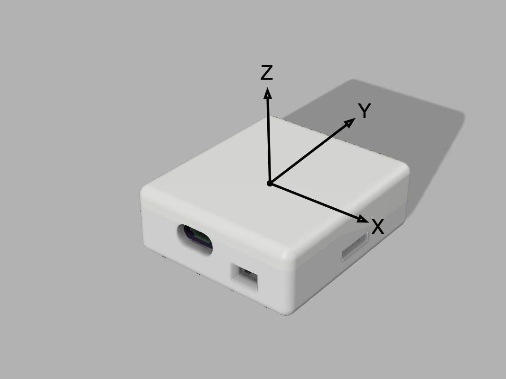

# Log File Format

A Dropkick log is a CSV text file. It is composed of [NMEA 0183](https://en.wikipedia.org/wiki/NMEA_0183) standard GPS records, or "sentences" using NMEA terminology,
 interspersed with the application-specific sentences described below.

 While the dropick box is turned on, a new log file will be created when the device detects that aircraft carrying the skydiver has taken off.  Logging continues 
 until a short time after the jumper reaches the ground.

 ## Time bases

 Some NMEA sentences include a UTC timestamp computed by the GNSS receiver. A native clock in an Arduino application is the
 millis() system call.  It is a unsigned 32-bit value reflecting the number of milliseconds
 elapsed since boot time.  Both time values
 will appear in a log file.  These two timelines are designed to be correlated using information in a $PTH sentence, described below.

## NMEA Checksums

As of version 55/155, all sentences end with a three character NMEA checksum sequence ("*HH", where HH is the hex representation of the checksum byte).  These  are omitted from the examples shown below for clarity.

## $PVER Record

A single instance of this record appears as the first sentence of each log.  It documents
 the software version used to create the file. The app version is an integer version number; the "hundreds" digit is used to
 designate whether the file originated frpm a Dropkick(0) or the newer Tempo board(1). This is an imperfect scheme.  It will make for future issues
 with versioning semantics. I'll have to fix that with an updated version of this sentence some time later.

### Comma-separated Fields

 | Description   |                                        |
 |---------------|----------------------------------------|
| $PVER         | Record identifier                      |
| id string | ID of this app version   |
| version number       | an integer version number of the application; a '1' in the decimal hundreds place indicatess it was created by Tempo, not Dropkick        |

### Example 

`$PVER,"Dropkick, version 0.52",52`

## $PIMU Record

### For Dropkick boards

PIMU record logs sensor information from the [MPU6050 IMU IC](https://invensense.tdk.com/wp-content/uploads/2015/02/MPU-6000-Datasheet1.pdf).  The MPU6050 is mounted on the
Dropkick PCB such that the postive X-Axis projects out the SD card slot, the positive Y-Axis projects out the face opposite the USB port, and the positive Z-Axis projects out the "top" of the enclosure.  Since the device might be carried by a skydiver in almost any orientation, it would be up to analysis software to discern the body orientation inferred by actual readings.

### For Tempo boards

The ICM42688-V IMU is installed on Tempo Boards. Values are reported in Case Axes (body axes), shown below.

### Comma-separated Fields

| Description   |                                        |
|---------------|----------------------------------------|
| $PIMU         | Record identifier                      |
| millis() timestamp | Time of sample in milliseconds    |
| X-accel       | expressed in meters per second squared          |
| Y-accel       | expressed in meters per second squared          |
| Z-accel       | expressed in meters per second  squared       |
| X-rate       | raw X rotation rate; expressed in radians per second         |
| Y-rate       | raw Y rotation rate; expressed in radians per second         |
| Z-rate       | raw Z rotation rate; expressed in radians per second         |

Dropkick board Body Axes

Template board Axes, including the Case (or Body) Axis definitions

## $PIM2 Record (Tempo boards only)

This is the real-time orientation of the jumper expressed as a [Quaternion](https://en.wikipedia.org/wiki/Quaternions_and_spatial_rotation).

The application maintains this orientation quaternion using a 200Hz sample
stream from the IMU. A startup value of [1,0,0,0] is used,
and orientation quaternion is updated to reflect all changes in the body axes from
that original orientation.

This raw orientation quaternion must be transformed into some world frame of reference - North-East-Down, for example - 
in order for it to be useful in analysis of a jump.  I have a few approaches to this in mind, but it remains
as future work in this project.

### Comma-separated Fields

| Description   |                                        |
|---------------|----------------------------------------|
| $PIM2         | Record identifier                      |
| millis() timestamp | Time of sample in milliseconds    |
| W       |    quaternion w component, nondimensional      |
| X      |    quaternion x component, nondimensional        |
| Y      |    quaternion y component, nondimensional     |
| Z     |   quaternion z component, nondimensional   |

### $PIM2 Example

`$PIM2,13925127,1.0000,0.0000,0.0000,0.0000`

## $PENV Record

This record logs pressure information captured from the 
[DPS310 sensor IC](https://www.infineon.com/dgdl/Infineon-DPS310-DataSheet-v01_02-EN.pdf?fileId=5546d462576f34750157750826c42242) and a resistor ladder used to monitor the VBATT battery line voltage level.

### Comma-separated Fields
| Description   |                                        |
|---------------|----------------------------------------|
| $PENV         | Record identifier                      |
| millis() timestamp | Time of sample in milliseconds    |
| static air  pressure       | expressed in hPa         |
| estimated altitude | based on static air pressure reading for a standard day; expressed in feet         |
| VBATT voltage      | battery voltage level (3.5V - 3.8V typ.); sampled once every 30 seconds; 
battery voltage isn't reported  on Tempo boards: the value will be set to -1    |

### $PENV Example

`$PENV,13925040,984.62,791.18,3.79`

## $PTH Record

 A PTH record is used to correlate Arduino millis() timestamps with the GNSS computed time of day
  clock information that appears in standard NMEA sentences.  A PTH record will appear immediately 
  following each NMEA GGA or GGL record.  The timestamp present in the record reflects the millis() time at the arrival
  of the first character of the NMEA record.

### $PTH Example

`$PTH,13925296`

## $PSFC Record

This records the estimated surface altitude of the landing area. This value is currently computed directly from the static air pressure assuming a [standard air pressure
lapse rate](https://en.wikipedia.org/wiki/Atmospheric_pressure).

This value can be subtraced from the altitude reports in $PENV sentences to obtain an estimated height above ground level (AGL)

### Comma-separated Fields

| Description   |                                        |
|---------------|----------------------------------------|
| $PSFC         | Record identifier                      |
| estimated surface altitude | Expressed in feet, MSL. Technically speaking, this value reflects the pressure sampled at the device.   |

### $PSFC Example

`$PSFC,880`

# $PST Record

This record records application state changes. This internal state machine is used to
identify when to start and stop loggin of each jump. 

The application defines WAIT, FLIGHT, JUMPING, and LANDED1 states.  This infomation might be useful to
isolate specific segments of the jump for post-jump analysis.

### Comma-separated Fields

| Description   |                                        |
|---------------|----------------------------------------|
| $PSFC         | Record identifier                      |
| millis() timestamp | Time of state change in milliseconds   |
| New State | WAIT, FLIGHT, JUMPING, or LANDED1  |

### $PST Example

`$PST,1000,FLIGHT`

## Sentence Reporting Rates

Sensor records are written to the file at these rates:

| Sentence Type      |  Reporting Rate |
|:----------------:|:---------------------------------|
|  PVER            | appears as the first line of a log file |
|  PSFC            | follows the PVER sentence |
|  GNSS position report            |       2 Hz |
|  PIMU            |      40 Hz |
|  PIM2            | follows each $PIMU sentence|
|  PENV            |       4 Hz    |
|  PTH             | follows each GGA and VTG record|
|  PST             | at each internal state change in the logger |

Valid for version 55/155 and later