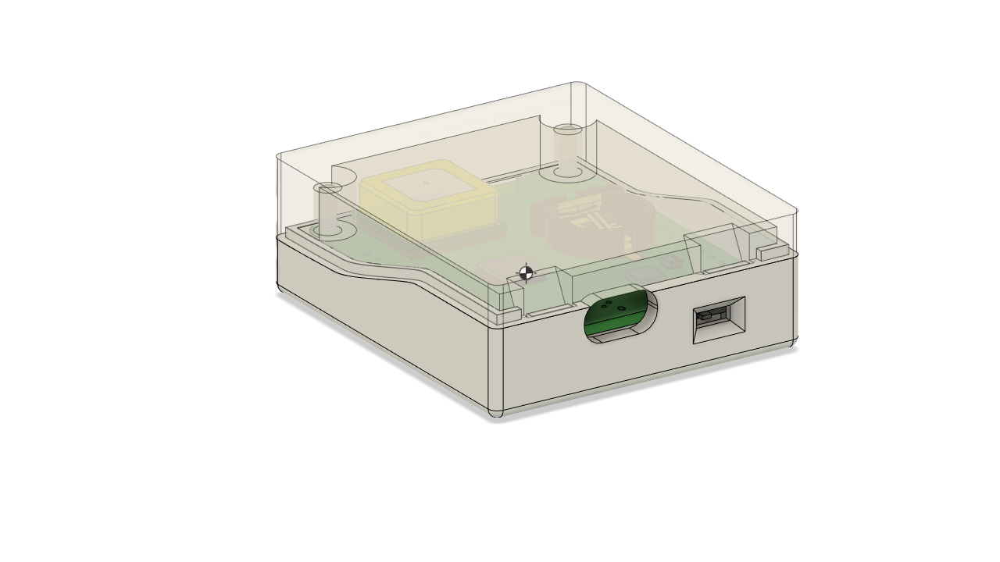
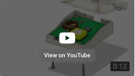
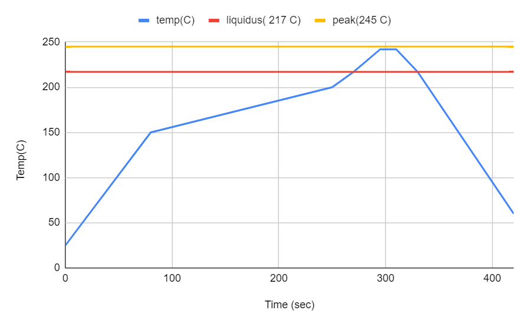

# Dropkick
**An experimental logger for skydivers**

These devices are designed to be carried in a skydiver's breast pocket. The device loggs GPS position, barometric altitude, body rotation rates, and acceleration forces.
Data is logged to a SD card for analysis on the ground.

There are two board variants active in thie project: V4 SAM, is the board I use for skydiving. V5-CAM is a design repurposed for real-time
use on a telescope poiting experiments. See [CHANGELOG.md](CHANGELOG.md) for a more detailed history.

## Sponsorship
I'd like to thank [PCBWay](https://www.pcbway.com/) for their generous sponsorship. PCBWay supplied prototype PCBs and solder stencils for the CAM variant of this project. My experience with PCBWay predates their sponsorship here. In my experience, PCBWay has been a great choice for my projects. They deliver good PCBs and accurate stencils quickly.
 
 ## Description

This is a stand-alone, battery-powered data logger designed to be
carried by a skydiver during their jump.  It includes a GNSS (GPS) receiver, 6-DOF IMU, and altitude sensors. Data from all sensors is logged onto a Micro-SD card. The logged data can be reviewed post-jump by to-be-designed software.

One objective of this project is to research compact GNSS receiver performance in the dynamic environment that a skydiver routinely experiences. As such, there are currently two different u-blox receiver modules that I'm testing. There is a distinct PCB for each board variant.

## Directory Structure
* **pcb-sam** - KiCad 6 PCB project files for the [u-blox SAM-M10Q](https://content.u-blox.com/sites/default/files/SAM-M8Q_DataSheet_%28UBX-16012619%29.pdf) variant (this is the preferred variant for skydiving)
* **pcb-cam** - KiCad 7 PCB project files for the [u-blox CAM-M8](https://content.u-blox.com/sites/default/files/CAM-M8-FW3_DataSheet_%28UBX-15031574%29.pdf) variant
* **enclosure** - Fusion 360 enclosure; designed to be 3D-printed
* **firmware** - Arduino-based firmware for the microcontroller
* **images** - supporting images and videos
* **analysis** - GNU Octave-based log file analysis software

Gerber production files generated by KiCad are included in the PCB directories.

Exploded enclosure view (click to view)

## Specifications

Dimensions: 58mm x 51mm x 20mm

Power: rechargeable 500mAh Li-Polymer battery

Weight: 55 grams

Storage: removable microSD card

Log file format: one log file for each jump; raw log format is an extension of NMEA0183. Details to follow.

USB micro-B connector (for recharging and programming)

Bootloader programmed via a 10-pin J-Link compatible connector; routine Arduino programming via the USB connector.

** Compiling Firmware
The Arduino board type should be set to "Adafruit Trinket M0" with Tiny USB enabled.

These libraries are required:
- Adafruit_BMP3XX
- ICM42688
- SparkFun u-blox GNSS Arduino_Library
- MicroNMEA  (2.0.6)
- SD (install the custom fork that I maintain on github)

## PCB Notes
My prototype circuit boards were fabricated by both OSHPark and PCBgogo. Both are excellent manufacturers for hobbyists.

### Bootloader

I flash all variants with the [Adafruit Trinket M0 UF2 bootloader](https://github.com/adafruit/uf2-samdx1/releases/download/v3.15.0/bootloader-trinket_m0-v3.15.0.bin) bin image. The current version is 3.15. Programming is performed via a Segger J-Link USB adapter using Microchip Studio (formerly Atmel Studio). Use Device = "ATSAMD21G18A". Program from the bootload .bin image file and then set the USER_WORD_0.NVMCTRL_BOOTPROT fuse to 8192 bytes.

## Solder Reflow

The solder reflow process has turned out to be a tricky step in constructing the PCBs, particularly with the SAM-M8Q IC.  Basically it requires extra heat soak in
  order to properly flow the solder.  Some u-blox instructions are repeated below, but I'll ultimately add some notes about what worked best for me.

The [u-blox Hardware Integration Manual](https://www.u-blox.com/en/docs/UBX-16018358) provides some detailed requirements for soldering the GNSS module to a PCB:

> ### Soldering paste

>Use of "no clean" soldering paste is highly recommended, as it does not require cleaning after the soldering process has taken place. The paste in the example below meets these criteria.

> * Soldering paste: OM338 SAC405 / Nr.143714 (Cookson Electronics)

> * Alloy specification: Sn 95.5/ Ag 4/ Cu 0.5 (95.5% tin/ 4% silver/ 0.5% copper)

> * Melting temperature: 217 °C

> * Stencil thickness: 120 um

> The final choice of the soldering paste depends on the approved manufacturing procedures. The paste-mask geometry for applying soldering paste should meet the recommendations. 

> ### Reflow soldering

> A convection-type soldering oven is highly recommended over the infrared-type radiation oven. Convection-heated ovens allow precise control of the temperature, and all parts will heat up evenly, regardless of material properties, thickness of components and surface color. As a reference, see the "IPC-7530 Guidelines for temperature profiling for mass soldering (reflowand wave) processes”, published in 2001.

> ### Preheat phase

>During the initial heating of component leads and balls, residual humidity will be dried out. Note that this preheat phase will not replace prior baking procedures.

> * Temperature rise rate: max. 3 °C/s. If the temperature rise is too rapid in the preheat phase it maycause excessive slumping.

> * Time: 60 - 120 s. If the preheat is insufficient, rather large solder balls tend to generate. Conversely, if performed excessively, fine balls and large balls will be generated in clusters.

> * End temperature: 150 - 200 °C. If the temperature is too low, non-melting tends to be caused inareas containing large heat capacity. 

> ### Heating and Reflow Phase

> The temperature rises above the liquidus temperature of 217 °C. Avoid a sudden rise in temperatureas the slump of the paste could become worse.

> * Limit time above 217 °C liquidus temperature: 40 - 60s

> * Peak reflow temperature: 245 °C

SAC405 solder paste is relatively expensive. I have been unable to locate SAC405 in hobbyist-friendly quantities, so I opted to use SAC305 for these prototypes. The melting qualities are quite similar, and it retains the essential "no clean" properties required by U-blox -- at the cost of [potentially having slightly less sound solder connections](https://citeseerx.ist.psu.edu/viewdoc/download?doi=10.1.1.517.4830&rep=rep1&type=pdf#:~:text=The%20North%20American%20industry%20generally,comparable%20to%20that%20of%20SAC405.).

I own a very basic infrared-type reflow oven, a Puhui T962. Even though infrared ovens are not recommended by U-blox, I decided to use it and pay careful attention to the programming of heating profile. First, I did a series to timing experiments with the standard profiles comparing them against the u-blox requirements. It turned out that my oven does not have a standard heating profile that would comply with these requirements. In particular, the closest standard profile held the oven temperature above 217 °C for roughly 90 seconds. That's far longer than the 40 to 60 seconds stated in the requirements. I had to develop a custom profile to match.

I programmed this profile into the reflow oven:

## Enclosure Notes
The enclosure is designed to be 3D printed. Tolerances between the upper enclosure, lower enclosure, and the PCB
 are quite tight - printing precision will be important. Since 3D printing technologies will vary in their precision, 
 you may need to scale or otherwise modify the objects to adequately match the final measurements in the original design.

For example, I printed the prototype enclosure on a MakerBot Replicator 2 (PLA) printer.  Using the default print settings
 I know that an object will shrink typically by about 1% post-printing.  I set the scale to 101% to compensate for that 
 in the MakerBot Desktop tooling and the end result works well.

## Credits

This PCB design is based on several Adafruit Feather and Stemma QT sensor boards.  Adafruit maintains a family of
 excellent microcontroller and sensor evalation boards and companion software.  Support them. They deserve it.

The enclosure for this project was designed using the personal edition of Fusion 360. Autodesk supports the Maker community through access to this epic design tool.  Try it out.

## Disclaimer
THE SOFTWARE IS PROVIDED "AS IS", WITHOUT WARRANTY OF ANY KIND, EXPRESS OR IMPLIED, INCLUDING BUT NOT LIMITED TO THE WARRANTIES OF MERCHANTABILITY,
FITNESS FOR A PARTICULAR PURPOSE AND NONINFRINGEMENT. IN NO EVENT SHALL THE
AUTHORS OR COPYRIGHT HOLDERS BE LIABLE FOR ANY CLAIM, DAMAGES OR OTHER
LIABILITY, WHETHER IN AN ACTION OF CONTRACT, TORT OR OTHERWISE, ARISING FROM,
OUT OF OR IN CONNECTION WITH THE SOFTWARE OR THE USE OR OTHER DEALINGS IN THE
SOFTWARE.
