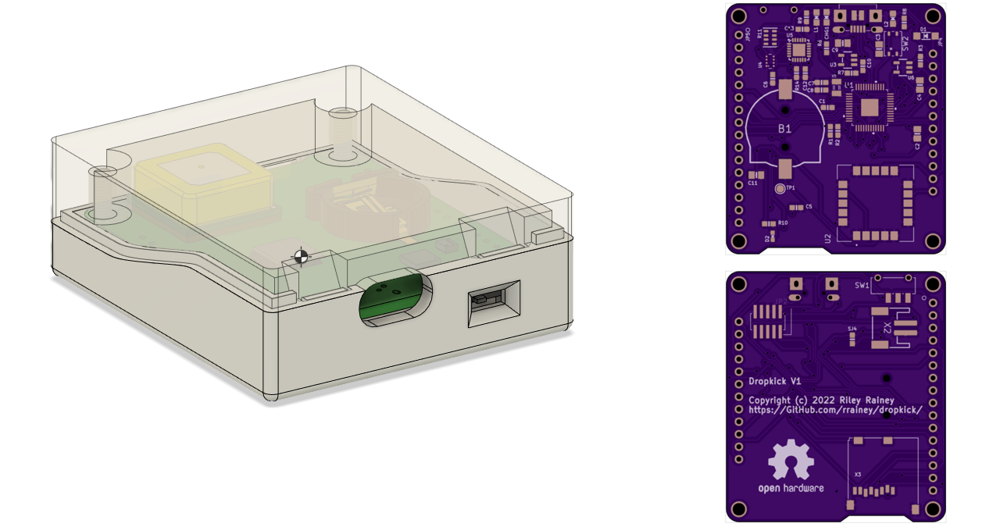

# Dropkick
An experimental logger for skydivers

This is a stand-alone battery-powered data logger designed to be
carried by a skydiver during their jump.  In includes a GPS, IMU, and altitude sensors. Data from all sensors is logged onto a Micro-SD card. The logged data can be reviewed post-jump by to-be-designed software.

# Directories
* **pcb** - KiCad 6 PCB project
* **enlosure** - Fusion 360 enclosure; designed to be 3D-printed
* **firmware** - Arduino-based firmware for the microcontroller
* **images** - supporting images and videos

## Specifications

Dimensions: 58mm x 51mm x 20mm

Power: 500mAh Li-Polymer battery

Storage: removable microSD card

USB micro-B connector (recharging and programming)

## Credits
This PCB design is based on several Adafruit Feather and Stemma QT boards.  Please support Adafruit where you can.

## Disclaimer
THE SOFTWARE IS PROVIDED "AS IS", WITHOUT WARRANTY OF ANY KIND, EXPRESS OR
IMPLIED, INCLUDING BUT NOT LIMITED TO THE WARRANTIES OF MERCHANTABILITY,
FITNESS FOR A PARTICULAR PURPOSE AND NONINFRINGEMENT. IN NO EVENT SHALL THE
AUTHORS OR COPYRIGHT HOLDERS BE LIABLE FOR ANY CLAIM, DAMAGES OR OTHER
LIABILITY, WHETHER IN AN ACTION OF CONTRACT, TORT OR OTHERWISE, ARISING FROM,
OUT OF OR IN CONNECTION WITH THE SOFTWARE OR THE USE OR OTHER DEALINGS IN THE
SOFTWARE.
