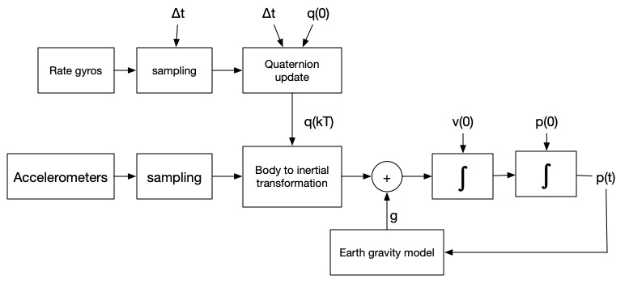

## General

The main module of this GNU Octave code is Modeler.m.

```bash
$ octave
octave:1>  [t_plot, a_norm_plot, a_filt_plot, ssim] = Modeler.analyze('LOG00014.TXT');
```



$$
\begin{bmatrix}
\dot{q_0} \\
\dot{q_1} \\
\dot{q_2} \\
\dot{q_3}
\end{bmatrix} = - \frac{1}{2} \begin{bmatrix*}[r] 
 0  &  P  &  Q  &  R \\
-P  &  0  & -R  & Q \\
-Q  &  R  & 0   & -P \\
-R  & -Q  &  P  &  0 \\
\end{bmatrix*}
\begin{bmatrix}
q_0 \\
q_1 \\
q_2 \\
q_3
\end{bmatrix}
$$

From ANSI/AIAA R-004-1992 "Atmospheric and Space Flight Vehicle Coordinate Systems"; Euler body angles can be recovered from an orientation Quaternion in this way:

$$
\begin{split}
\phi & =\arctan[ \frac{ 2( q_2 q_3 + q_0 q_1 ) }{ ( q_0^2 + q_3^2 - q_1^2 - q_2^2 ) } ] \\
\\
\theta & = \arcsin[-2 ( q_1 q_3 - q_0 q_2 )] \\
\\
\psi & =  \arctan[ \frac{2( q_1 q_2 + q_0 q_3 ) }{( q_0^2 + q_1^2 - q_2^2 - q_3^2 ) } ] \\
\\
\end{split}
$$

For orientation quaternion initialization, (estimated) body angles may be used:

$$
\begin{split} 
\\
q_0 & = \cos(\frac{\psi}{2}) \cos(\frac{\theta}{2})  \cos(\frac{\phi}{2 }) + 
      \sin(\frac{\psi}{2}) \sin(\frac{\theta}{2})  \sin(\frac{\phi}{2 }) \\
\\
q_1 & = \cos(\frac{\psi}{2}) \cos(\frac{\theta}{2})  \sin(\frac{\phi}{2 }) -
      \sin(\frac{\psi}{2}) \sin(\frac{\theta}{2})  \cos(\frac{\phi}{2 }) \\
\\
q_2 & = \cos(\frac{\psi}{2}) \sin(\frac{\theta}{2})  \cos(\frac{\phi}{2 }) +
      \sin(\frac{\psi}{2}) \cos(\frac{\theta}{2})  \sin(\frac{\phi}{2 }) \\
\\
q_3 & = - \cos(\frac{\psi}{2}) \sin(\frac{\theta}{2})  \sin(\frac{\phi}{2}) +
      \sin(\frac{\psi}{2}) \cos(\frac{\theta}{2})  \cos(\frac{\phi}{2}) \\
\\
\end{split}
$$

Body axes are AIAA-standard, which is X out-the-nose, Y out-the-right-wing, and Z down.

The AIAA-standard North-East-Down coordinate frame is used to express world cordinates. Origin X and Y coordinates for each log file are arbirarily chosen to be the XY location at the start of the log. If needed, the first reported GNSS position may be used to establish the NED origin (with appropriate Z correction applied to compensate for altitude)

|   Variables       |                        |
|:------------------:|------------------------|
| $P, Q, R$     | Body angular velocity rates (sampled) (rad/sec) |
| $a_{B}$ | Sampled body acceleration (m/sec^2)
| $a, v, p$     | 3D Acceleration (sampled), velocity, and position in NED frame (meters) |
| $q$             | Body orientation quaterion (NED Frame) |
| $\phi, \theta, \psi$ | roll, pitch, yaw body angles (radians) |

The gravity model used during analysis is to be determined.

Adams-Bashforth third-order integration is used to integrate NED velocity and position.

$$x_{n+1} = x_{n} + \frac{T}{12} ( 5 \dot{x}_{n+1} + 8 \dot{x}_n - \dot{x}_{n-1}) ) $$

Where $T$ is the time step.

Euler integration is used for the first two time steps to prime the ABM integrator.